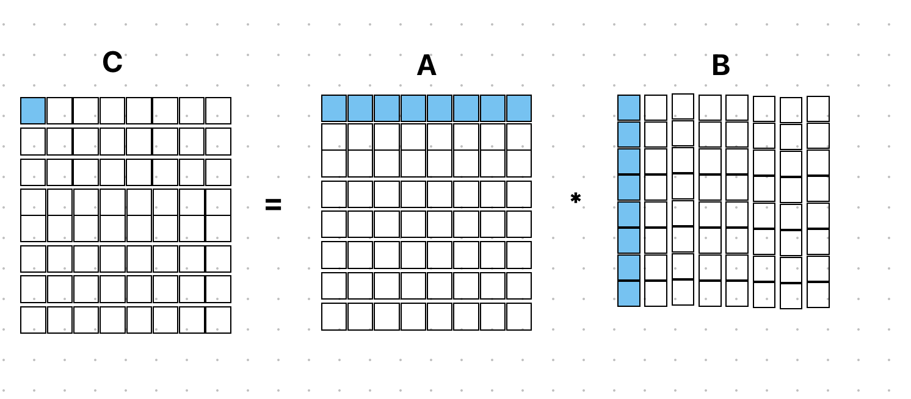
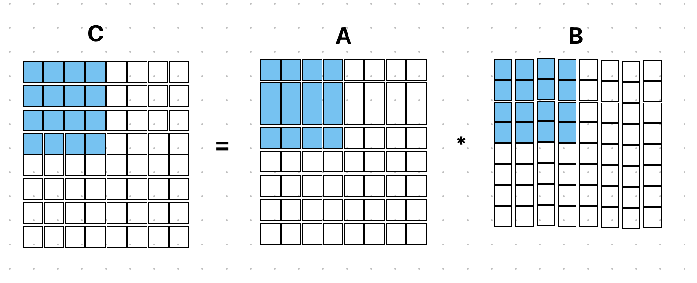
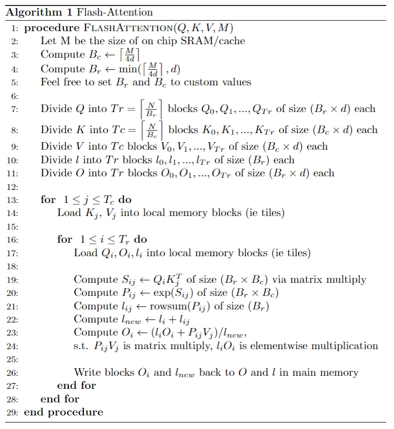

# NanoGPT149

​	NanoGPT是OpenAI 前研究科学家Andrej Karpathy开源的基于GPT-2实现的一个小模型， 本项目要求模仿cuDNN的实现，使用C++实现NanoGPT transformer层的核心部分——多头注意力的计算，并且在数学、访存和并行计算上做出优化。

```python
class CausalSelfAttention(nn.Module):
    ...
    def forward(self, x):
        B, T, C = x.size() # batch size, sequence length, embedding dimensionality (n_embd)

        # calculate query, key, values for all heads in batch and move head forward to be the batch dim
        q, k, v  = self.c_attn(x).split(self.n_embd, dim=2)
        k = k.view(B, T, self.n_head, C // self.n_head).transpose(1, 2) # (B, nh, T, hs)
        q = q.view(B, T, self.n_head, C // self.n_head).transpose(1, 2) # (B, nh, T, hs)
        v = v.view(B, T, self.n_head, C // self.n_head).transpose(1, 2) # (B, nh, T, hs)
        N = T
        H = self.n_head
        d = C // self.n_head
        
        ...
        
        temp = torch.zeros((N, N))
        att2 = ms.myAttention(q, k, v, temp, B, H, N, d)
        
```

​	transformer的核心注意力层代码如上所示，输入的词向量x经过线性层c_attn后，线性映射为Q, K, V三个张量，每个张量都有4个维度B, H, N, d.

```C++
/* 
 * B (Batch Size) - The number of samples for your attention layer. Think of it this way - if I asked my dnn
 * a question and it output 5 different answers it had a batch size of 5. These samples are independent of each other and thus can be parallelized.
 *
 * H (Number of Heads) - Each head runs on its own set of Q, K, V matrices. This effectively allows each head
 * to operate the same attention algorithm, but each with each head using different hyperparameters. These
 * allow each head to have their own definition of what relevance is when looking at a token. These heads
 * can operate independently of one another and thus can be parallized.
 *
 * N (Sequence Length) - The number of tokens. You may think of this as the number of words in a sample.
 *
 * d (Embedding Dimensionality) - The number of features each token encodes per attention head. Let's
 * say I encoded a word using the follow (length, number of vowels, has a capital letters). The
 * emvedded dimensionaliy would be 3.
 */
```


Q, K, V经过myAttention函数后计算出注意力矩阵：<br>
<p align="center"> $$Attention(Q, K, V) = softmax(QK^T) V$$ </p>
​	myAttention函数需要我们用C++实现

## 环境配置

​	因为我的电脑上没有pytorch+cuda环境，所以我在autoDL上租了一个容器实例来跑这个项目（成本巨大），容器镜像选用的是 Pytorch2.1.2 + Python3.10 + ubuntu22.04。(用别的pytorch版本会有module_ref.so运行失败的问题)

​	配置好以后测试一下模型推理功能，在命令行运行

```shell
python3 gpt149.py part0 --inference -m shakes128
```

nanoGPT模型会生成莎士比亚风格的文本

```shell
No CUDA runtime is found, using CUDA_HOME='/usr/local/cuda'

Compiling code into a PyTorch module...


Running inference using dnn model shakes128
number of parameters: 0.80M
Loading meta from data/shakespeare_char/meta.pkl...
An any, so beast, sir, promise to make
Of the she obedle me to my grows:
They will the friends down my heart.

LEONTES:
When is is in a thousand do enough of yours of well.

POLIXENES:
The prialle will supper her loven of your rest.

POLI
-------------------------------------------------------------
It no King Lick o' Adentoman he will take shall
From to judgmenied wood, for the soul professived
That stole my may to trial sto
-------------------------------------------------------------
```


## warm-up C++访问4维张量

​	逻辑上4维的张量其实在内存中是1维的，也就是所有数据都连续的存放在内存中，这样的内存布局符合性能优化的空间局部性原理，很多高性能计算库都采用这样的数据结构，通过计算元素在张量中的偏移来访问元素。

```c++
inline float fourDimRead(std::vector<float> &tensor, int &x, int &y, int &z, int &b, 
        const int &sizeX, const int &sizeY, const int &sizeZ) {
    return tensor[x * (sizeX * sizeY * sizeZ) + y * (sizeY * sizeZ) + z * (sizeZ) + b];
}

inline void fourDimWrite(std::vector<float> &tensor, int &x, int &y, int &z, int &b, 
        const int &sizeX, const int &sizeY, const int &sizeZ, float &val) {
    tensor[x * (sizeX * sizeY * sizeZ) + y * (sizeY * sizeZ) + z * (sizeZ) + b] = val;
}
```

## part1 A Simple (But Not So Efficient) Implementation of Attention

​	part1要求实现最基础的注意力层nativeAttention，循环每个Batch和Head, 计算attention。确定了Batch index 和 Head index 后，Q 和 K 退化为2维张量，shape为（N，d）。

​	先计算 $QK^T$,  shape为(N, N)。

​	再对 $QK^T$ 的每一行计算softmax， 结果仍然保存在 $QK^T$ 中。

​	最后计算 $QK^T * V$ ，shape为(N, d), 保存在O中。

```c++
for (int b = 0; b < B; b++){
        for (int h = 0; h < H; h++){

            for (int i = 0; i < N; i++){
                for (int j = 0; j < N; j++){
                    float temp = 0.0;
                    for(int k = 0; k < d; k++){
                        temp += fourDimRead(Q, b, h, i, k, H, N, d) * fourDimRead(K, b, h, j, k, H, N, d);
                    }
                    twoDimWrite(QK_t, i, j, N, temp);
                }
            }

            for(int i = 0;  i < N; i++){
                float exp_sum = 0.0;
                for(int j = 0; j < N; j++){
                    float element =  twoDimRead(QK_t, i, j, N);
                    element = std::exp(element);
                    exp_sum += element;
                    twoDimWrite(QK_t, i, j, N, element);
                }
                for(int j = 0; j < N; j++){
                    float element =  twoDimRead(QK_t, i, j, N);
                    element = element / exp_sum;
                    twoDimWrite(QK_t, i, j, N, element);
                }
            }

            for (int i = 0; i < N; i++){
                for (int j = 0; j < d; j++){
                    float temp = 0.0;
                    for (int k = 0; k < N; k++){
                        temp += twoDimRead(QK_t, i, k, N) * fourDimRead(V, b, h, k, j, H, N, d);
                    }
                    fourDimWrite(O, b, h, i, j, H, N, d, temp);
                }
            }
        }
    }
```


## part2 Blocked Matrix Multiply and Unfused Softmax

​	part1的nativeAttention包含了两个矩阵乘法操作和一个softmax操作，其中朴素的矩阵乘法算子存在缓存命中率过低的问题。例如计算C = A * B, C的每个元素需要求A的一行与B的一列的点乘，当缓存不足以放下大矩阵的一行时，缓存中的数据总是要被替换掉以存放新数据，导致缓存命中率非常低。



​	因此优化为分块矩阵乘法，每个矩阵块单独计算矩阵乘法，这样缓存行可以存放下分块后的矩阵行，进行分块矩阵乘法时缓存行就可以重复利用，能够提高缓存命中率。



​	Q 和 K 的 shape 为 （N, d），可能不是 tile_size 的整数倍，因此需要考虑分块后剩余的不足一整块的部分，称为“remainder tail”， 其维度为`min(tile_size, N-tileIndex*tileSize)`

```c++
torch::Tensor myUnfusedAttentionBlocked(torch::Tensor QTensor, torch::Tensor KTensor, torch::Tensor VTensor, torch::Tensor QK_tTensor,
                int B, int H, int N, int d){
    
    // Q, K, V are passed in with Shape: (B, H, N, d)
    //QK^t Intermediate Tensor has Shape (N, N)

    //Make O Tensor with Shape (B, H, N, d) 
    at::Tensor OTensor = at::zeros({B, H, N, d}, at::kFloat);

    //Format O, Q, K, and V tensors into 4D vectors
    std::vector<float> O = formatTensor(OTensor);
    std::vector<float> Q = formatTensor(QTensor);
    std::vector<float> K = formatTensor(KTensor);
    std::vector<float> V = formatTensor(VTensor);

    //Format QK_t Tensor into a 2D vector.
    std::vector<float> QK_t = formatTensor(QK_tTensor);

    // -------- YOUR CODE HERE  -------- //
    int tile_size = 16;
    int tile_num_N = (N + tile_size - 1) / tile_size;
    int tile_num_d = (d + tile_size - 1) / tile_size; 
    for (int b = 0; b < B; b++){
        for (int h = 0; h < H; h++){
                       
            for (int i_tile = 0; i_tile < tile_num_N; i_tile++){
                for (int j_tile = 0; j_tile < tile_num_N; j_tile++){
                    int i_begin = i_tile * tile_size;
                    int i_end = i_begin + std::min(tile_size, N - i_tile * tile_size);
                    int j_begin = j_tile * tile_size;
                    int j_end = j_begin + std::min(tile_size, N - j_tile * tile_size);
                    
                    for(int k_tile = 0; k_tile < tile_num_d; k_tile++){
                        int k_begin = k_tile * tile_size;
                        int k_end = k_begin + std::min(tile_size, d - k_tile * tile_size);
                        for(int i = i_begin; i < i_end; i++){
                            for(int j = j_begin; j < j_end; j++){
                                float temp = twoDimRead(QK_t, i, j, N);
                                for(int k = k_begin; k < k_end; k++){
                                    temp += fourDimRead(Q, b, h, i, k, H, N, d) * fourDimRead(K, b, h, j, k, H, N, d);
                                } 
                                twoDimWrite(QK_t, i, j, N, temp);
                            }
                        }
                    }
                }
            }

            for(int i = 0;  i < N; i++){
                float exp_sum = 0.0;
                for(int j = 0; j < N; j++){
                    float element =  twoDimRead(QK_t, i, j, N);
                    element = std::exp(element);
                    exp_sum += element;
                    twoDimWrite(QK_t, i, j, N, element);
                }
                for(int j = 0; j < N; j++){
                    float element =  twoDimRead(QK_t, i, j, N);
                    element = element / exp_sum;
                    twoDimWrite(QK_t, i, j, N, element);
                }
            }

            for (int i_tile = 0; i_tile < tile_num_N; i_tile++){
                for (int j_tile = 0; j_tile < tile_num_d; j_tile++){
                    int i_begin = i_tile * tile_size;
                    int i_end = i_begin + std::min(tile_size, N - i_tile * tile_size);
                    int j_begin = j_tile * tile_size;
                    int j_end = j_begin + std::min(tile_size, d - j_tile * tile_size);
                    
                    for(int k_tile = 0; k_tile < tile_num_N; k_tile++){
                        int k_begin = k_tile * tile_size;
                        int k_end = k_begin + std::min(tile_size, N - k_tile * tile_size);
                        for(int i = i_begin; i < i_end; i++){
                            for(int j = j_begin; j < j_end; j++){
                                float temp = fourDimRead(O, b, h, i, j, H, N, d);
                                for(int k = k_begin; k < k_end; k++){
                                    temp += twoDimRead(QK_t, i, k, N) * fourDimRead(V, b, h, k, j, H, N, d);
                                } 
                                fourDimWrite(O, b, h, i, j, H, N, d, temp);
                            }
                        }
                    }
                }
            }

            
        }
    }
    // DO NOT EDIT THIS RETURN STATEMENT //
    // It formats your C++ Vector O back into a Tensor of Shape (B, H, N, d) and returns it //
    return torch::from_blob(O.data(), {B, H, N, d}, torch::TensorOptions().dtype(torch::kFloat32)).clone();
}
```

## part3 Fused Attention

​	part1的nativeAttention方案，需要一个中间矩阵来存放 $QK^T$ ，这个中间矩阵的shape为（N, N），并且nativeAttention需要对这个N*N矩阵的每一行都做softmax操作后，再与另一个N * d的矩阵V做矩阵乘法，这样对缓存和内存访问都不够友好。

​	出于性能优化的考虑，可以将这些操作进行融合，并且只使用一个N * 1的向量来代替原来N * N的中间矩阵。具体操作为每次将Q的一行与 $K^T$ 相乘，得到的中间结果存在N * 1的向量ORow中，再对ORow计算softmax, 再和V相乘，结果写到输出矩阵O中。这样相当于将两个矩阵乘法和一个softmax操作融合到一起了。另外可以使用openmp对前三层循环进行多线程并行的优化。

```c++
torch::Tensor myFusedAttention(torch::Tensor QTensor, torch::Tensor KTensor, torch::Tensor VTensor, torch::Tensor temp,
                int B, int H, int N, int d){

    // Q, K, V are passed in with Shape: (B, H, N, d)

    //Make O Tensor with Shape (B, H, N, d)
    //and O Row Tensor with Shape (N)
    at::Tensor OTensor = at::zeros({B, H, N, d}, at::kFloat);
    at::Tensor ORowTensor = at::zeros({N}, at::kFloat);

    //Format Y, Q, K, and V tensors into 4D vectors
    std::vector<float> O = formatTensor(OTensor);
    std::vector<float> Q = formatTensor(QTensor);
    std::vector<float> K = formatTensor(KTensor);
    std::vector<float> V = formatTensor(VTensor);
    
    //Format ORow Tensor into a 1D vector
    // You can simply access this as ORow[i]
    std::vector<float> ORow = formatTensor(ORowTensor);


    // -------- YOUR CODE HERE  -------- //
    // We give you a template of the first three loops for your convenience
    //loop over batch
    #pragma omp parallel for collapse(3)
    for (int b = 0; b < B; b++){

        //loop over heads
        for (int h = 0; h < H; h++){
            for (int i = 0; i < N ; i++){
                
		// YRow is moved inside so each OpenMP thread gets a local copy.
                at::Tensor ORowTensor = temp.index({torch::indexing::Slice(omp_get_thread_num(), torch::indexing::None)});      
                std::vector<float> ORow = formatTensor(ORowTensor);
		//YOUR CODE HERE
                for (int j = 0; j < N; j++) {
                    float temp = 0.0;
                    for (int k = 0; k < d; k++) {
                        temp += fourDimRead(Q, b, h, i, k, H, N, d) * fourDimRead(K, b, h, j, k, H, N, d);
                    }
                    ORow[j] = temp;
                }

                float exp_sum = 0.0;
                for(int j = 0; j < N; j++){
                    ORow[j] = std::exp(ORow[j]);
                    exp_sum += ORow[j];
                }
                for(int j = 0; j < N; j++){
                    ORow[j] /= exp_sum;
                }

                for (int j = 0; j < d; j++){
                    float temp = 0.0;
                    for (int k = 0; k < N; k++){
                        temp += ORow[k] * fourDimRead(V, b, h, k, j, H, N, d);
                    }
                    fourDimWrite(O, b, h, i, j, H, N, d, temp);
                }
                
            }
	}
    }
	    	
    // DO NOT EDIT THIS RETURN STATEMENT //
    // It formats your C++ Vector O back into a Tensor of Shape (B, H, N, d) and returns it //
    return torch::from_blob(O.data(), {B, H, N, d}, torch::TensorOptions().dtype(torch::kFloat32)).clone();
}
```

## part4 Putting it all Together - Flash Attention

​	part2使用了分块矩阵乘法进行优化，part3使用了算子融合进行优化，那可不可以把part2和part3的优化思路结合到一起呢？这里的难点在于softmax算子必须要有完整一行的 $l(x) =  \Sigma{e^x}$ 信息，而分块矩阵乘法每次只算一个分块，不会一次性访问一行，所以两种算子融合存在难度。

​	Flash Attention算法给出的解决方案是，每次计算一个分块行的softmax, 并且保存当前分块的 $l(x)$ 信息， $l(x)$是softmax式子中的分母，迭代到该行的下一个分块时，更新 $l_{new}(x) $, 用 $l_{new}(x)$替换原来softmax式子中的分母， 迭代地计算每一行的softmax。



​	根据给出的算法伪代码进行C++实现

```C++
torch::Tensor myFlashAttention(torch::Tensor QTensor, torch::Tensor KTensor, torch::Tensor VTensor,
               torch::Tensor QiTensor, torch::Tensor KjTensor, torch::Tensor VjTensor,
               torch::Tensor SijTensor, torch::Tensor PijTensor, torch::Tensor PVTensor,
               torch::Tensor OiTensor, torch::Tensor LTensor,  torch::Tensor LiTensor, 
	       torch::Tensor LijTensor, torch::Tensor LnewTensor, int Bc, int Br,
                int B, int H, int N, int d) {
        
    // Q, K, V are passed in with Shape: (B, H, N, d)
    // Sij, Pij are passed in with Shape: (Br, Bc)
    // Kj, Vj are passed in with Shape: (Bc, d)
    // Qi, Oi, and PV  are passed in with Shape: (Br, d)
    // L in passed in with Shape: (N)
    // Li, Lij, and Lnew are passed in with shape (Br)

    //Make O Tensor with Shape (B, H, N, d)
    at::Tensor OTensor = at::zeros({B, H, N, d}, at::kFloat);
   
    //Format All Tensors into Vectors
    std::vector<float> O = formatTensor(OTensor);
    std::vector<float> Q = formatTensor(QTensor);
    std::vector<float> K = formatTensor(KTensor);
    std::vector<float> V = formatTensor(VTensor);

            


    // -------- YOUR CODE HERE  -------- //
    int Tr = (N + Br - 1) / Br;
    int Tc = (N + Bc - 1) / Bc;
    for(int b = 0; b < B; b++){
        for(int h = 0; h < H; h++){

            std::vector<float> Sij = formatTensor(SijTensor);
            std::vector<float> Pij = formatTensor(PijTensor);
            std::vector<float> Kj = formatTensor(KjTensor);
            std::vector<float> Vj = formatTensor(VjTensor);
            std::vector<float> Qi = formatTensor(QiTensor);
            std::vector<float> Oi = formatTensor(OiTensor);
            std::vector<float> l = formatTensor(LTensor);
            std::vector<float> PV = formatTensor(PVTensor);
            std::vector<float> li = formatTensor(LiTensor);
            std::vector<float> lij = formatTensor(LijTensor);
            std::vector<float> lnew = formatTensor(LnewTensor);
            for(int j = 0; j < Tc; j++){
                //load Ki, Vj into local memory blocks
                int mc = std::min(Bc, N - j * Bc);
                int r_begin = j * Bc;
                int r_end = r_begin + mc;
                for(int r = r_begin; r < r_end; r++){
                    int r_index = r - r_begin;
                    for(int c = 0; c < d; c++){
                        float k_element = fourDimRead(K, b, h, r, c, H, N, d);
                        float v_element = fourDimRead(V, b, h, r, c, H, N, d);
                        twoDimWrite(Kj, r_index, c, d, k_element);
                        twoDimWrite(Vj, r_index, c, d, v_element);
                    }
                } 

                for(int i = 0; i < Tr; i++){
                    //load Qi, Oi, li into local memory block
                    int mr = std::min(Br, N - i * Br);
                    int r_begin = i * Br;
                    int r_end = r_begin + mr;
                    for(int r = r_begin; r < r_end; r++){
                        int r_index = r - r_begin;
                        for(int c = 0; c < d; c++){
                            float Q_element = fourDimRead(Q, b, h, r, c, H, N, d);
                            float O_element = fourDimRead(O, b, h, r, c, H, N, d);
                            twoDimWrite(Qi, r_index, c, d, Q_element);
                            twoDimWrite(Oi, r_index, c, d, O_element);                           
                        }               
                        li[r_index] = l[r];
                    }                  

                    //Sij = Qi * Kj ^ T
                    for(int r = 0; r < mr; r++){
                        for(int c = 0; c < mc; c++){
                            float temp = 0.0;
                            for(int k = 0; k < d; k++){
                                temp += twoDimRead(Qi, r, k, d) * twoDimRead(Kj, c, k, d);
                            }
                            twoDimWrite(Sij, r, c, Bc, temp);
                        }
                    }

                    //Pij = exp(Sij)
                    for(int r = 0; r < mr; r++){
                        for(int c = 0; c < mc; c++){
                            float temp =  std::exp(twoDimRead(Sij, r, c, Bc));
                            twoDimWrite(Pij, r, c, Bc, temp);
                        }
                    }

                    //lij = rowsum(Pij)
                    for(int r = 0; r < mr; r++){
                        float temp = 0.0;
                        for(int c = 0; c < mc; c++){
                            temp += twoDimRead(Pij, r, c, Bc);
                        }
                        lij[r] = temp;
                    }

                    //lnew = li + lij
                    for(int r = 0; r < mr; r++){
                        lnew[r] = li[r] + lij[r];
                    }

                    //Oi = (l * Oi + Pij * Vj) / lnew
                    for(int r = 0; r < mr; r++){
                        for(int c = 0; c < d; c++){
                            float temp = 0.0;   
                            temp += li[r] * twoDimRead(Oi, r, c, d);               
                            for(int k = 0; k < mc; k++){
                                temp += twoDimRead(Pij, r, k, Bc) * twoDimRead(Vj, k, c, d);
                            }
                            temp /= lnew[r];
                            twoDimWrite(Oi, r, c, d, temp);
                        }
                    }

                    //write back Oi and lnew to O and l in main memory
                    for(int r = 0;  r < mr; r++){
                        int r_index = i * Br + r;
                        l[r_index] = lnew[r];
                        for(int c = 0; c < d; c++){
                            float Oi_element = twoDimRead(Oi, r, c, d);
                            fourDimWrite(O, b, h, r_index, c, H, N, d, Oi_element);
                        }
                    }
                }
            }
        }
    }


    // DO NOT EDIT THIS RETURN STATEMENT //
    // It formats your C++ Vector O back into a Tensor of Shape (B, H, N, d) and returns it //
    return torch::from_blob(O.data(), {B, H, N, d}, torch::TensorOptions().dtype(torch::kFloat32)).clone();
}
```

